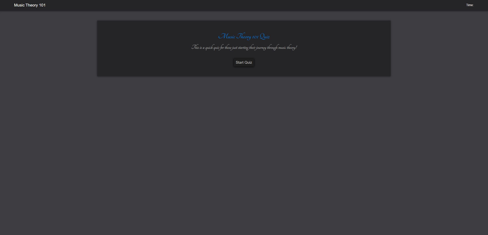

# Music Quiz

# User Story

AS A student of a music theory class
I WANT to take a quiz on basic music theory facts
SO THAT I can test my understanding of music theory.

# Description

- This web applicatiosn uses APIs and Javascript to create a music theory quiz.
- Users are able to take a quiz, see their results, and their past results
- If a user is right, they move on to the next questiosn.
- If the user is wrong, they get time deducted from their score.
- There is a score awarded at the end.

# Technologies

- HTML
- CSS
- Javascript

# Screenshot

# Link

https://github.com/krumbelievable/Music_Quiz
https://krumbelievable.github.io/Music_Quiz/
